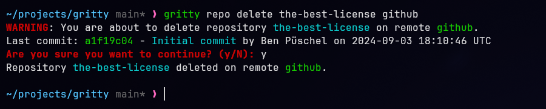

# gritty

Gritty is a command line tool to manage your remote repositories on GitHub,
GitLab and Gitea remotes, written in Rust.

Gritty is designed to be simple and easy to use, with a focus on the most common
repository management tasks. It is not meant to be a full-featured Git client, but
rather a tool to let you focus on what's important: your code.


# Quick Start

1. Install gritty using the [precompiled binaries](#precompiled-binaries) or by building from source.
2. Interactively configure gritty by running `gritty create-config` (See [Create-Config](#create-config)).

Now you can use gritty to manage your repositories!
See the [Usage](#usage) and [Examples](#Examples) sections for more information
on the available commands.

# Installation

## Precompiled Binaries

Precompiled binaries are available on the [releases page](https://github.com/benpueschel/gritty/releases).
These binaries are built for Linux, MacOS, and Windows.

Just download and extract the archive for your platform and add the binary to your PATH.
One great way to do this is to move the binary to `/usr/local/bin` on Linux or
MacOS, which should already be in your PATH.
The releases also include checksums to verify the integrity of the downloaded files.

## From Source

To build from source, you will need to have Rust installed. You can install
Rust by following the instructions on the [official website](https://www.rust-lang.org/tools/install).
I recommend using `rustup` to manage your Rust installation and toolchains.

Once you have rust installed, clone this repository and build gritty in release mode
(which optimizes the binary and strips debug symbols):
```bash
cargo build --release
```
PLEASE NOTE: building from main is not recommended as it may be unstable.
Consider checking out a release tag instead.

The binary will be located at `target/release/gritty`.
You can move this binary to a directory in your PATH to use it globally:
```bash
sudo mv target/release/gritty /usr/local/bin
```
For Windows, the binary will be located at `target\release\gritty.exe`.
Where you move it is up to you, but it must be in your PATH to use it globally.

# Usage

To see the available commands and options, run:
```bash
gritty help
```

If you didn't manually create a configuration file, running `gritty create-config` will
create a default configuration file in the default location for your platform.
You can then edit this file to add your remotes and access tokens.

Gritty currently supports the following subcommands:
- `gritty create-config`: interactively create a configuration file.
- `gritty auth [remote]`: authenticate with the specified remote.
- `gritty clone [repo] [remote]`: clone a repository from the specified remote.
- `gritty create [repo] [remote]`: create a new repository on the specified remote.
- `gritty delete [repo] [remote]`: delete a repository from the specified remote.
- `gritty list [remote]`: list all repositories on the specified remote.
- `gritty list-remotes`: list all remotes in the configuration file.

To see the available options for a subcommand, run:
```bash
gritty help [subcommand]
```

## Create-Config

The `create-config` subcommand will ask you a series of questions to create a
configuration file for gritty. This file is located at `~/.config/gritty/config.toml`
by default, but you can specify a different location if you like.

The questions are as follows:
1. Enter the config file path (default: ~/.config/gritty/config.toml). Leave blank for default.
2. How do you want to store your access tokens? (Keyring, SecretsFile, Plaintext)
   - Keyring: uses the system keyring to store access tokens (HIGHLY RECOMMENDED).
   - SecretsFile: stores access tokens in a plaintext file.
   - Plaintext: stores access tokens directly in the config file.
3. Do you want to add a remote? (y/n). Answer 'y' to configure remotes.
   - Enter the remote name (e.g. github, gh, gitea, awesome-sauce).
   - Enter the provider (GitHub, Gitea, GitLabj).
   - Enter the remote URL (e.g. https://github.com, https://gitea.example.com).
   - Enter your username for the remote.
   - Enter the clone protocol (ssh, https).
   - Do you want to add authentication for this remote? (y/n). Answer 'y' to authenticate.
     - Enter your token.
   - Do you want to add another remote? (y/n). Answer 'y' to add another remote.
     The process will repeat until you answer 'n'.

The configuration file will be automatically created at the specified path, if you've
added authentication for your remotes in the previous step, you can begin using gritty
right away.

After creating your configuration file, you can authenticate with a remote using:
```bash
gritty auth [remote]
```
This command will prompt you for your username and password. Leave the username
blank to use an access token (which you should definitely do because gritty doesn't
support Basic Auth with a password yet).
Please note that this step is required if using keyring storage for access tokens.

After authenticating, you can use the other subcommands to manage your repositories.

## Configuration

Gritty requires a configuration file to manage remotes and access tokens.
This file is located at `~/.config/gritty/config.toml` on Linux and MacOS, but
can use `~/.gritty/config.toml` as a fallback - though you need to manually move
the config to that path.

The configuration file is a TOML file with the following structure:
```toml
# This will use the system keyring to store access tokens.
# On Linux, you will need to have a keyring daemon,
# like gnome-keyring, installed and running.
# On MacOS and Windows, the keyring should work out of the box.
secrets = "Keyring"

# You can also store access tokens in a plaintext file:
# Please note that this is not recommended for security reasons.
#secrets.SecretsFile = "~/.config/gritty/secrets.toml"

# You can also store access tokens directly in the config file:
# Please note that this is by far the least secure option to store your tokens.
#[secrets.Plaintext.github]
#token = "your_access_token"
#[secrets.Plaintext.gitea]
#token = "your_access_token"

# You can add as many remotes as you like. The name of the remote is
# specified in square brackets after the `remotes` keyword. If you want the
# remote name to contain special characters like periods, you can wrap the
# remote name in quotes:
#[remotes."github.com"]
[remotes.github]
provider = "GitHub"
url = "https://github.com"
username = "your_username"
clone_protocol = "ssh" # or "https"

# This adds a second remote to the configuration file, using Gitea as the provider.
[remotes.gitea]
provider = "Gitea"
url = "https://gitea.example.com"
username = "your_username"
clone_protocol = "https" # or "ssh"

# You can also configure color output for gritty:
[colors.repo]
color = "Red"
background = "Black"
bold = true

[colors.important]
color = { r = 255, g = 10, b = 124 }
underline = true
italic = true

[colors.commit]
color = 24
inverse = true
```

### Colors
Gritty supports colored output for the following fields:
- important - used for error messages and important prompts (such as delete confirmation).
- repo - used for repository names
- origin - used for origin names
- remote - used for remote names
- username - used for usernames
- path - used for local paths
- protocol - used for clone protocols (ssh, https)
- url - used for remote URLs
- commit - used for commit hashes
- date - used for commit dates
- author - used for author names in commit messages
- commit_msg - used for commit messages
- warning - used for warning messages
- special - used for other special messages

The color can be specified as a string (e.g. "Red", "Blue", "Green"), as an 8-bit
ANSI color code (0-255), or as an RGB color code (r, g, b).
The background color can be specified in the same way.
You can also specify whether the text should be bold, italic, or underlined.
The `inverse` option will swap the text and background colors.

# Examples

To create a public repository on GitHub:
```bash
gritty create my-repo github
```

To create a private repository:
```bash
gritty create my-private-repo github --private
```
or use the shorthand:
```bash
gritty create -p my-private-repo github
```

Example output:


To list all repositories on Gitea:
```bash
gritty list gitea
```

Example output:


To delete a repository from a remote:
```bash
gritty delete my-repo my-awesome-remote
```
This will prompt you for confirmation and show you the last commit before deleting.

Example output:


